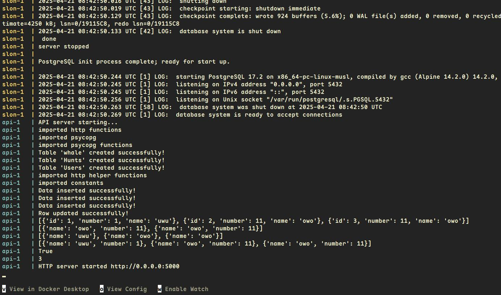

# Find Me: Lovecká hra

A digital hunting  game for exploring fun sites and interesting places.

> [!Notice]
> This project is a long term school project and has some additional information not relevant to the maintenance project itself, but for grading purposes.

🌍docs: [English](docs/docs.md), [České](docs/translations/CZ/dokumentaceCZ.md)

-----

-----

## What this repository contains:

- the server for hosting the Find Me game
- the firmware for the Find Me nodes
- instructions how to set up a self hosted instance of the Find Me server

## What this repository Doesn't contain

- the web application for players/admins
- schematics and instructions how to DIY make Find Me nodes

## Introduction

Find me is a digital game where a web interface communicates with nodes and the user "collects" them to complete a hunt. Any user can make a hunt if they own a starter node, since checkpoint nodes are just tools to mark a spot. This results in an large array of possible hunts made with fewer checkpoint nodes.

In this repository exist two separate parts of this project. Documentation for both of them is found in this repository. And documentation for the web interface can be found in a [separate repository]() at GitLab.

[Complete docs for how server and firmware work.](docs/docs.md)

# Instalation

// todo